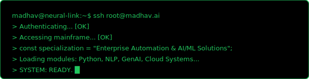

<!-- SYSTEM INITIALIZATION SEQUENCE -->

<code>STATUS: PATENT PENDING</code> | <code>ROLE: AUTOMATION ARCHITECT @ ORACLE</code>

<h3 align="center">~/ SYSTEM_TELEMETRY // IMPACT</h3>

<table align="center">
<tr>
<td align="center" width="200">
<h2 style="color: #22c55e; margin-bottom: 0;">99%</h2>
[Efficiency Gain]
</td>
<td align="center" width="200">
<h2 style="color: #22c55e; margin-bottom: 0;">900+</h2>
[Clients Scaled]
</td>
<td align="center" width="200">
<h2 style="color: #22c55e; margin-bottom: 0;">30M+</h2>
[Records Migrated]
</td>
<td align="center" width="200">
<h2 style="color: #22c55e; margin-bottom: 0;">01</h2>
[Patents Pending]
</td>
</tr>
</table>

<h3 align="center">~/ EXECUTION_STACK // MODULES</h3>

<h3 align="center">~/ GITHUB_DIAGNOSTICS // MADHAV-S-NAIR</h3>

<!-- Streak Stats Customized -->

<code>[ SYSTEM.END_OF_LINE ]</code>

